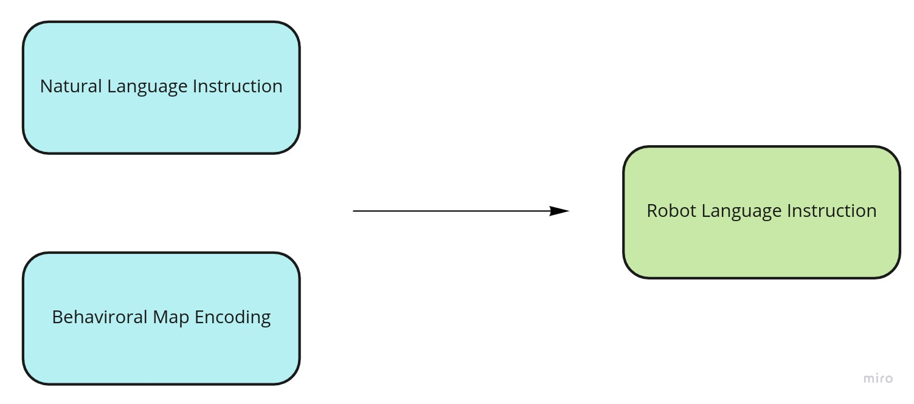
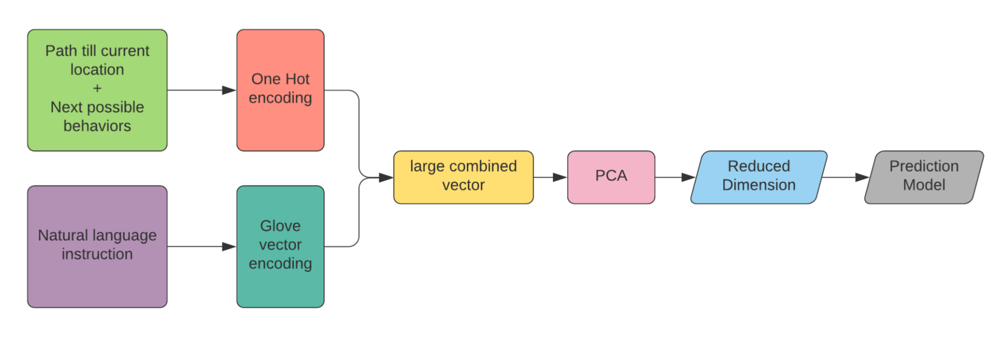
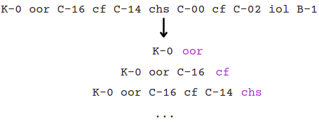
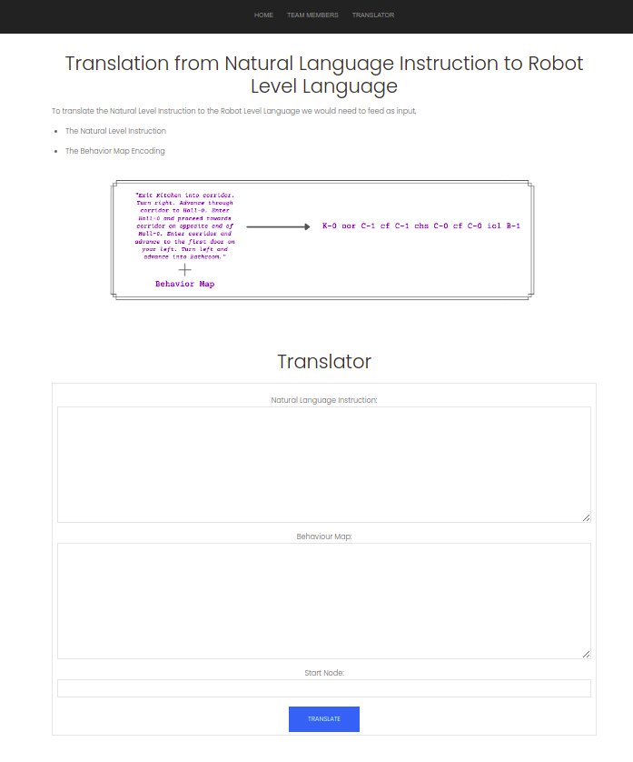
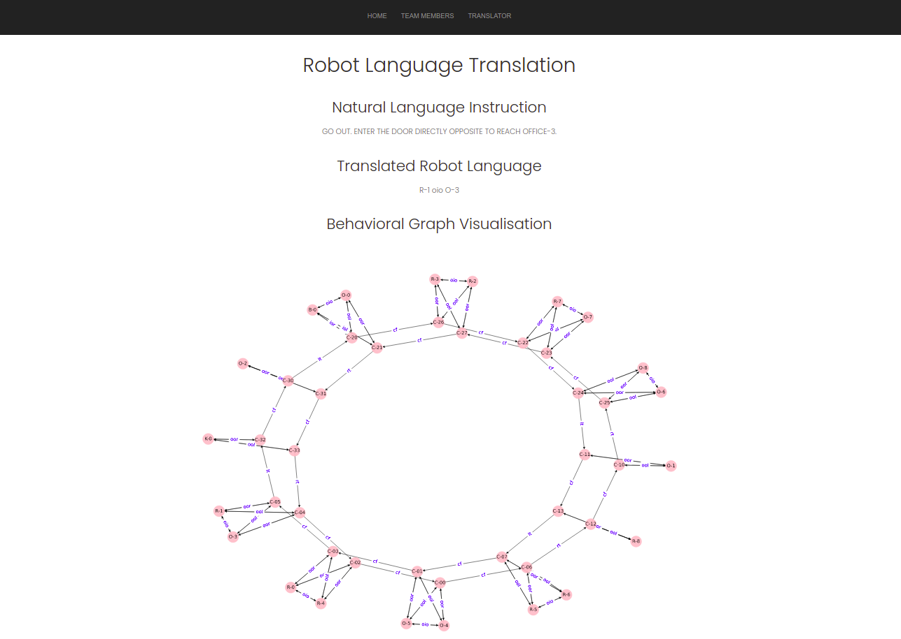

# Bottom-up Approach for translating Human Language to High-LevelRobot Language

## Problem Statement :pencil:



Our goal is to develop a bottom-up approach for translating English language instructions to High level Robot Instruction.

## Proposed Approach :bulb:


## Dataset :bookmark_tabs:
We use the dataset curated by ...

### Challenges in the dataset
The notion of directions was incorporated in the dataset. Any corridor can be traversed from either of the two opposite directions. (See example below)

```
O-4 ool C-1 nt O-4 K-0 H-2 N ; (Traversing corridor C-1 from the north direction)
O-4 oor C-1 nt O-4 K-0 H-2 S ; (Traversing corridor C-1 from the south direction)
``` 
This makes the behaviors **right** and **left** attributed. In the above example we have `ool` and `oor`

### Modifications in the dataset
To tackle the above challenge, we changed the dataset so that it fits well with our proposed approach. 

1. Firstly, we treated a particular corridor as seperate corridors when exploring from either directions.

```
O-4 ool C-1 nt O-4 K-0 H-2 N -> C-10
O-4 oor C-1 nt O-4 K-0 H-2 S -> C-11
```
2. To incorporate the notion of state or the path covered till now by the robot, we change the `data.answer` file in the [original dataset](). 
We break the translated path into various sets (as shown in the figure below) and treat the behaviors (colored in purple) as the labels of our modified dataset.


## Website :computer:
We built a working demo that takes in the following things as input, 
1. Natural Language Instruction
2. Behavioral Map encoding
3. Start Node

The output is the Robot Translation and a Graph View of the Behavioral Map.

### Snapshots



## Accuracy :dart:
We got a training accuracy of **99%** on the training dataset and a test accuracy of approximately **82%** on the test dataset

## References and Credits :books:
This project was part of the course **CS613: Natural Language Processing** offered at **IIT Gandhinagar** under the guidance of **Prof. Mayank Singh**. We would also like our mentor **Praveen Venkatesh** for guiding and helping us throughout the project. 

### References
1. Xiaoxue Zang and Ashwini Pokle and Marynel Vázquez and Kevin Chen and Juan Carlos Niebles and Alvaro Soto and Silvio Savarese (2018). Translating Navigation Instructions in Natural Language to a High-Level Plan for Behavioral Robot Navigation. CoRR, abs/1810.00663.


### Contributors
1. [Pranshu Kumar Gond](www.github.com/pranshu-kumar)
2. [Prasad Athave]()
3. [Tanishque Zaware]()
4. [Shardul Kulkarni]()